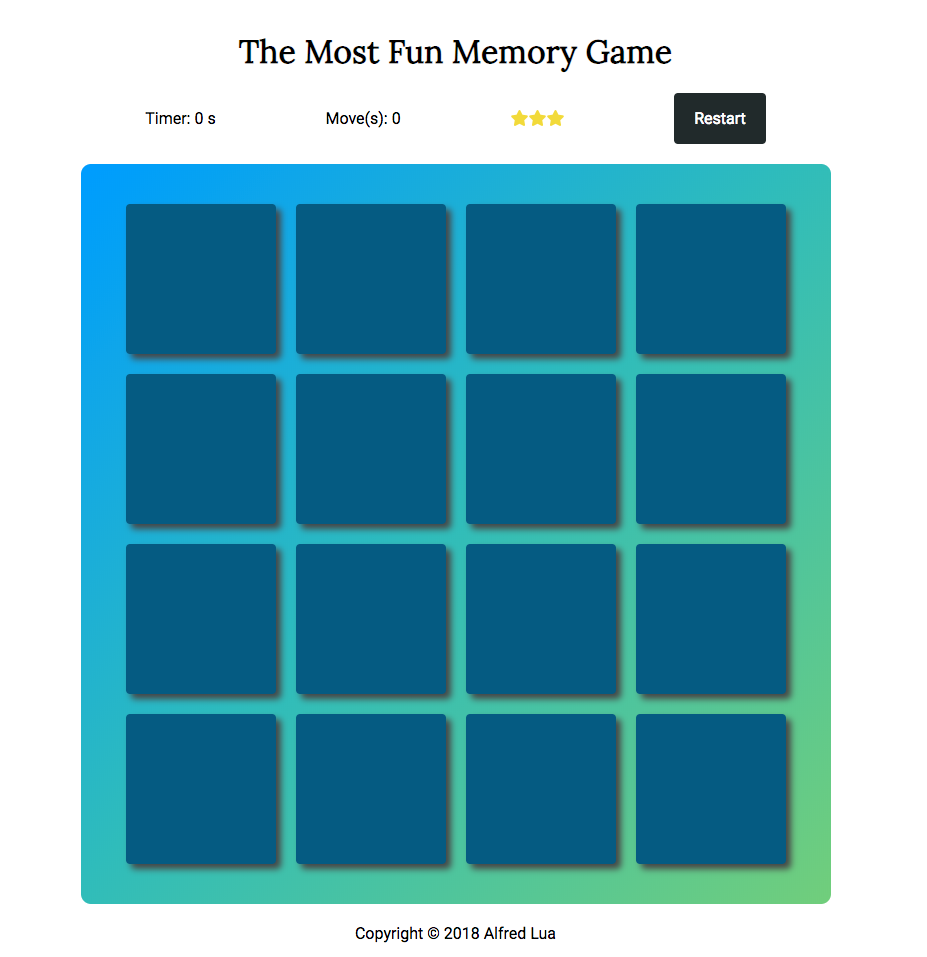

# The Most Fun Memory Game

This game is a test of the player's memory. The player has to match all eight pairs of cards to win the game.

## How to play

1. Load the game [here](https://htmlpreview.github.io/?https://github.com/alfredlua/memory-game/blob/initial-commit/index.html).
2. Click on two cards to try and match them.
3. When the cards don't match, they will be flipped close.
4. Match all eight pairs of cards to win the game.
5. Good luck!

## Spotted a bug?

I'll be grateful if you tweet me about it at [@alfred_lua](https://twitter.com/alfred_lua)!

## Misc

This is a Udacity course project built with HTML, CSS, and Javascript.

Big shoutout to [Sandra Israel-Ovirih](https://twitter.com/SandraIsrael_O) whose [blog post](https://scotch.io/tutorials/how-to-build-a-memory-matching-game-in-javascript) helped me a lot whenever I was stuck.